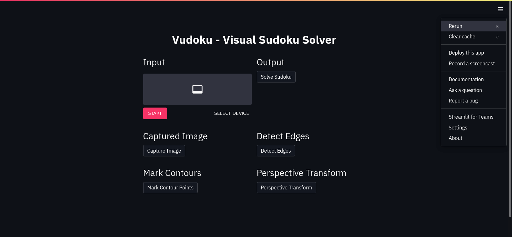
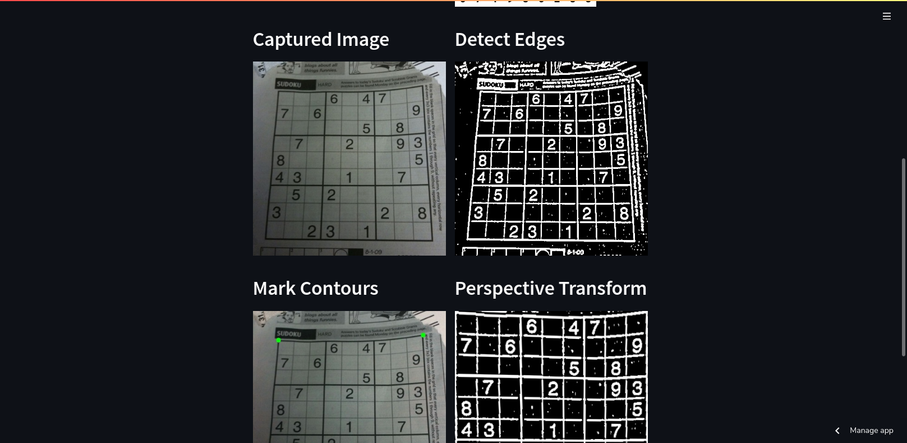

# Vudoku - A Visual Sudoku Solver

[](https://share.streamlit.io/joe733/vudoku/main/vudoku/main.py)
[](https://github.com/joe733/vudoku)

> [Commit](https://github.com/joe733/vudoku/tree/0b9f38e86119c4031e7668375236a37aaadde22d) when the project was submitted.

⚠️ **untested dependency update** ⚠️

## Sudoku

- Sudoku is a mathematical puzzle.
- Regular or a common Sudoku is a 9x9 grid split into 9 sub squares with sparse entries.

```txt
╔═══╤═══╤═══╦═══╤═══╤═══╦═══╤═══╤═══╗
║ 8 │ 5 │   ║   │   │ 2 ║ 4 │   │   ║
╟───┼───┼───╫───┼───┼───╫───┼───┼───╢
║ 7 │ 2 │   ║   │   │   ║   │   │ 9 ║
╟───┼───┼───╫───┼───┼───╫───┼───┼───╢
║   │   │ 4 ║   │   │   ║   │   │   ║
╠═══╪═══╪═══╬═══╪═══╪═══╬═══╪═══╪═══╣
║   │   │   ║ 1 │   │ 7 ║   │   │ 2 ║
╟───┼───┼───╫───┼───┼───╫───┼───┼───╢
║ 3 │   │ 5 ║   │   │   ║ 9 │   │   ║
╟───┼───┼───╫───┼───┼───╫───┼───┼───╢
║   │ 4 │   ║   │   │   ║   │   │   ║
╠═══╪═══╪═══╬═══╪═══╪═══╬═══╪═══╪═══╣
║   │   │   ║   │ 8 │   ║   │ 7 │   ║
╟───┼───┼───╫───┼───┼───╫───┼───┼───╢
║   │ 1 │ 7 ║   │   │   ║   │   │   ║
╟───┼───┼───╫───┼───┼───╫───┼───┼───╢
║   │   │   ║   │ 3 │ 6 ║   │ 4 │   ║
╚═══╧═══╧═══╩═══╧═══╧═══╩═══╧═══╧═══╝
```

- The goal is to fill the gird with numbers from 1 to 9
- To solve tt has three simple rules:
  - No repetition along a row
  - No repetition along a column
  - No repetition within a sub square

This project aims to solve 9x9 Sudoku squares using computer vision techniques. So here's the basic idea.

1. The system gets a video / image as input.
2. It scans the input and tries to detect a grid which gets saved.
3. The grid is then split into cells.
4. Each cell is parsed to get the data in it which is either `None` or `digit`.
5. After retrieving the numbers it's then given to the solver in string format.
6. The solver finds a solution and returns it to be displayed later.

Asking a computer to solve it requires translating Sudoku into code. This can be achieved in many ways, linear arrays, encoded and decoded strings, two dimensional arrays etc. This project uses simple string expression.

## DIY

### Online

The application has been deployed. Please visit [this link](https://share.streamlit.io/joe733/vudoku/main/src/vudoku/main.py).

### Offline

- Clone the repository: `git clone https://github.com/joe733/vudoku.git`
- Navigate to the project directory `cd vudoku`
- Run `pdm install` to create a virtual environment and install dependencies
- Source `. ./.venv/bin/activate` (replace `/bin/` with `/Scripts/` if you're on Windows) which will activate the virtual environment.
- Finally execute `streamlit run vudoku/main.py`.
- It should automatically redirect you to the browser, if not open the browser and go to <http://localhost:8501>.

## UI

|  |  |
| --------------------------------------------------------- | ------------------------------------------------------ |

## Task List

- [x] Get input frames from still images or video capture
- [x] Pre-process image, prep it to extract Sudoku grid
- [x] Grab the Sudoku box using contours of the maximum area
- [ ] Rectify flipped images after perspective transform
- [x] Split the grid into Sudoku boxes to extract digits
- [x] ~~Train a logistic regression classifier on MNIST data set - current random accuracy is around `91%`~~
- [x] Build and Train a keras Sequential Model (2 x Conv2D + MaxPool2D + Dropout + Flatten + Dense[ReLu] Dropout + Dense[SoftMax])
- [ ] Work on improving sudoku grabbing quality
  - [x] Get the digits recognized correctly
  - [ ] Pre-process the image (of a single digit) to remove excess / thick border
  - [ ] Scale and center the image
  - [x] ~~If nothing works, try a different solver or even another classifier.~~
  - [x] Encode the classified image into a 81 bit string
- [x] Solve the Sudoku using simple backtracking
- [x] ~~Additional module just to validate solved sudoku~~
- [x] Restructure the code and add a logical connections and control flow
- [x] Adds Streamlit GUI support
- [x] Deployed on Streamlit

### Extras

- [ ] Good to have a solid CLI interface
- [ ] Improve the number detection and grid splitting algorithm
- [x] ~~Host it on services like [PythonAnywhere](https://www.pythonanywhere.com/) / [Streamlit](https://streamlit.io/)~~

> **NB**: _If you find anything in this repository that is not properly cited please let me know, I'm be more than happy to rectify it._
